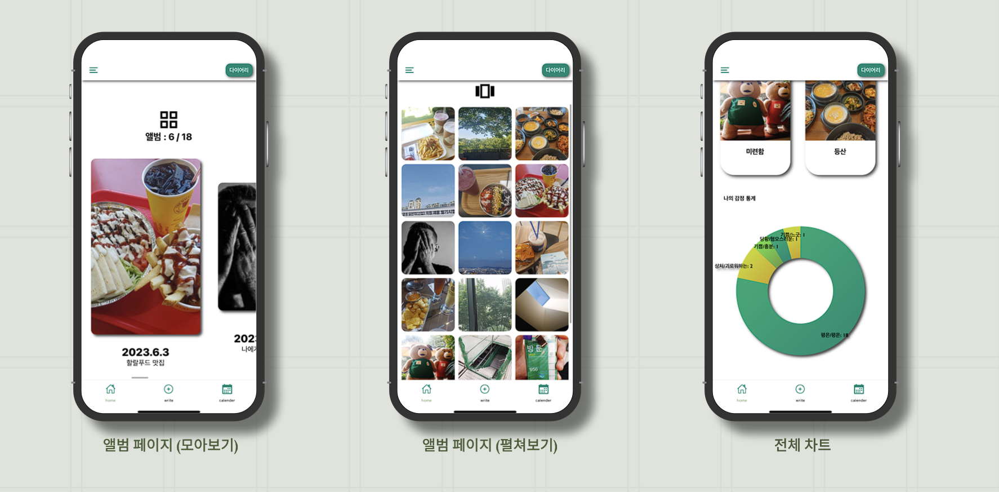
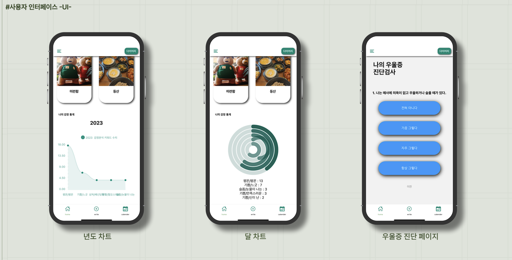
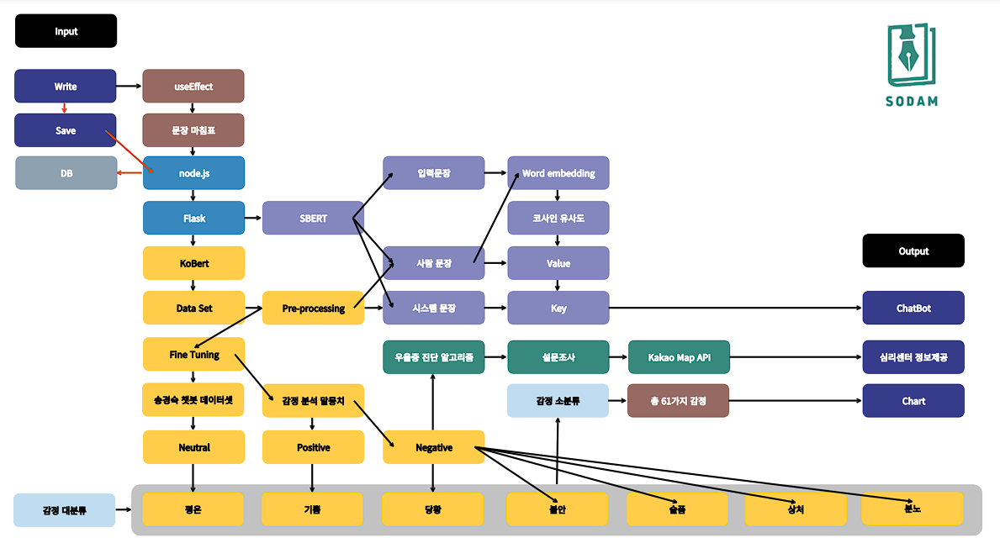

RestTeam project SODAMDiary
===========================
</img>   

### Sodam is a sentiment analysis diary project.
>감정분석 다이어리는 단순 자기가 기록한 것에 대한 감정을 재미로 뽑아보는 것이 전부 일 수도 있겠습니다. 하지만 일기라는 것이 ‘어디에서도 구할 수 없는 사용자의 솔직한 데이터’를 가장 빨리 접하는 곳이라고 생각했습니다. 어쩌면 마음이 불안한 사람, 부정적인 사람, 우울한 사람을 조기에 찾을 수도 있겠죠. 코로나 시대를 겪으면서 사회적 거리 두기가 시작되고, it 시대가 찾아오고 커뮤니티로 인해 사람들은 예민해지면서 우울증 환자는 그 어느 시대보다 급증하고 자살률이 높아졌습니다. 세계 보건 기구 WHO가 2030년에 느 인류에게 가장 부담을 주는 질환으로 꼽기도 했죠. 그래서 저희 팀은 우울증 환자를 대비하여 일기 쓰기의 장점과 실시간 ‘공감’기능으로 장점을 살려 부정적 감정을 케어하고 우울증을 조기 발견할 수 있는 어플, 소담을 만들었습니다.

-----------------------------------------------

<h3>Sodam 미리보기</h3>
</img>   
</img>   

<h3>소담 흐름도</h3>
</img>     
 

## 소담 프론트 사용법
> 사용전 준비물 <VSCode, NodeJs, expo, react-Native >
1. 프로젝트를 클론 및 다운로드합니다.
2. 핸드폰에 Expo Go 어플을 다운로드해준다.
3. vsCode, NodeJs, Expo, react-native 를 준비해준다.
4. 터미널에 폴더 찾아가서 npm install로 프로젝트 모듈을 다운로드한다.
5. npx expo start -c 를 통해서 실행시켜준다.
6. 큐알코드를 핸드폰으로 스캔해준다.

데이터를 사용하시려면 서버, 백엔드 단을 돌려주셔야합니다.
모델을 사용하시려면 모델 학습을 진행하고 절차에 따르셔야합니다.

프론트(React-Native) + 모델(Flask) + 백엔드(Node.Js) + 데이터베이스(MySQL)

==================
### 소담 백엔드 페이지 이동 / 소담 감정분석 모델 페이지 이동
<https://github.com/RestDiary/SODAMDiaryServer-Ver2>   
